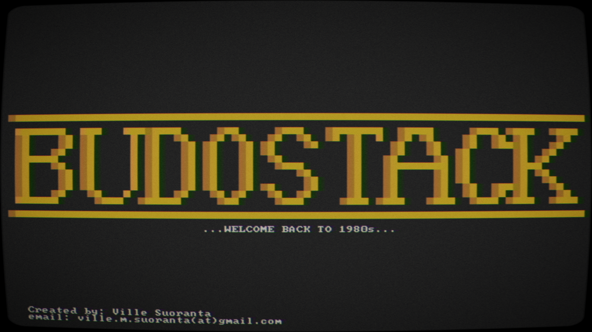
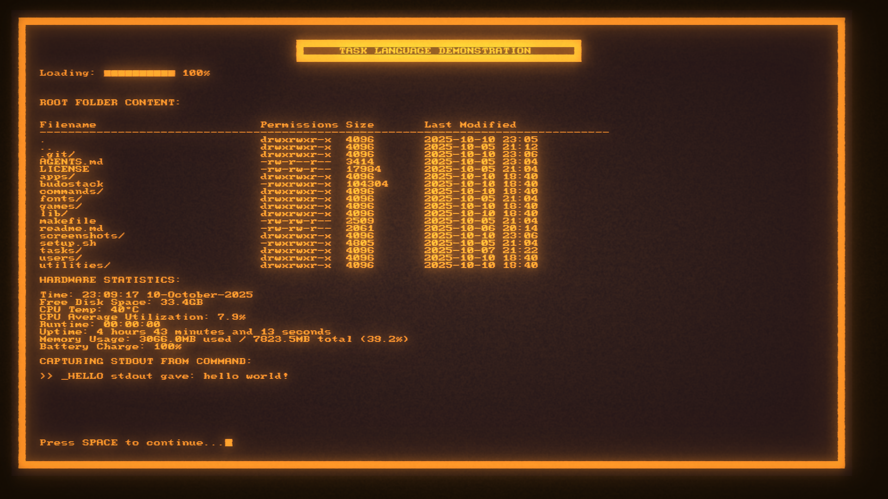
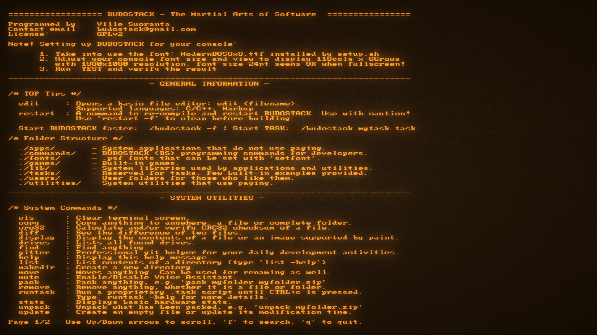

# BUDOSTACK - The Martial Art of Software
**Programmed by:** Ville Suoranta 
**Status:** Early Access (in development)

→ Check out development blog from [HERE](https://sensei-zenabi.github.io/suoranta/index.html)

### Motive:
_Fun little nostalgic project to explore AI capabilities in producing
code via e.g. CODEX github integration._

### Licence:
BUDOSTACK is distributed under the MIT License. This permissive licence allows
you to:
- Run the software for any purpose
- Study and modify the source code
- Redistribute copies, with or without modifications, provided you include the
  original copyright and licence notice

Bundled third-party assets retain their original licences:
- `lib/stb_image.h` — public domain or MIT (per upstream licence header)
- Fonts under `fonts/` — public domain (see `fonts/LICENSE.txt`)

## Description:
A lightweight operating "layer" built atop POSIX-compliant Linux, 
specifically designed for those who value the elegant simplicity 
and clarity found in operating systems of the 1980s. Optimized for 
maximum focus and efficiency on basic primitives of computing, 
such as file manipulation, text editing, command-line interactions, 
and efficient resource management.

I prefer running BUDOSTACK with [cool-retro-term](https://github.com/Swordfish90/cool-retro-term) using the provided 8x8 font.

|  |  |  |  |
|:---------------------------:|:---------------------------:|:---------------------------:|:---------------------------:|

## Dependencies
To successfully run BUDOSTACK, **Debian** based Linux distributions
are recommended. They provide the "sudo apt install" as default, which
is used e.g. in the setup.sh shell script to install applications 
utilized by BUDOSTACK to execute it's apps and commands. During the 
development of BUDOSTACK, it has been tested with following distros:
- Ubuntu
- Kubuntu
- Raspberry Pi OS

## How to Install and Run?
1. Checkout the repo
2. Run the ./setup.sh shell script
3. Type "./budostack -f" for fast start
4. Then type "help"

## How to Run Tasks?
TASK language is a proprietary BASIC like langauge built for BUDOSTACK
that enables users to develop their own programs using the built-in
applications, commands and utilities. Type 'runtask -help' to find out
more.
  
Below is an example how to start a TASK script:
- ./budostack script.task      (when starting from linux terminal)
- runtask script.task          (when starting from within BUDOSTACK)
