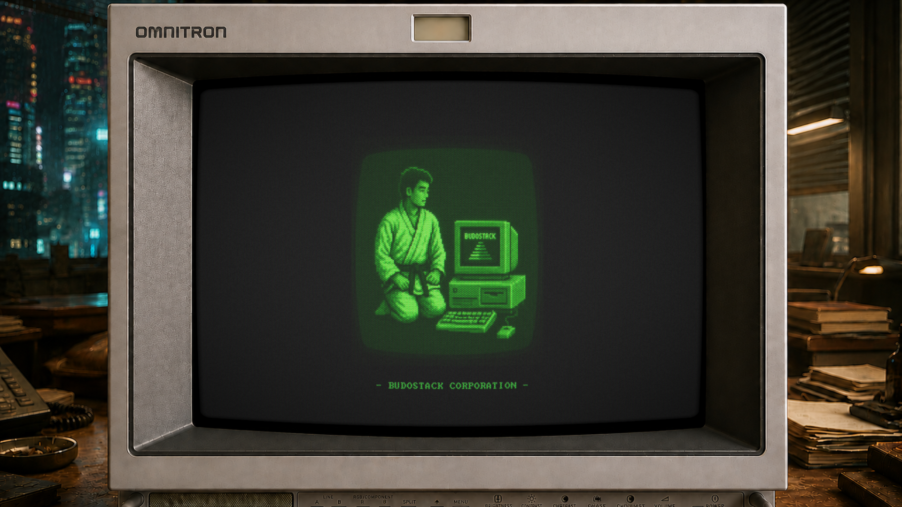
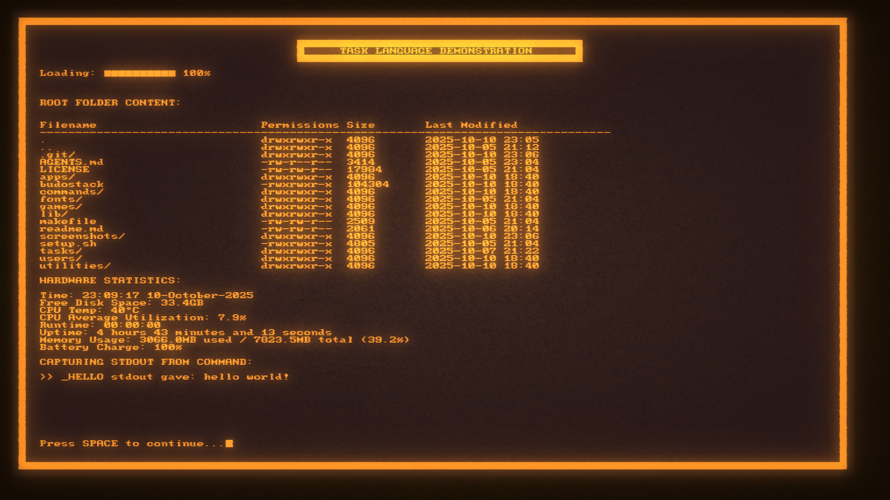
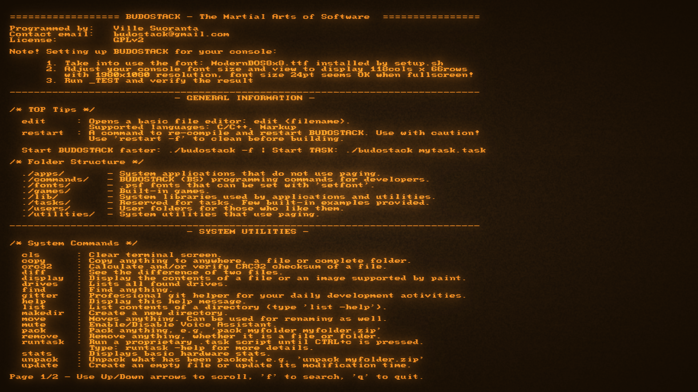
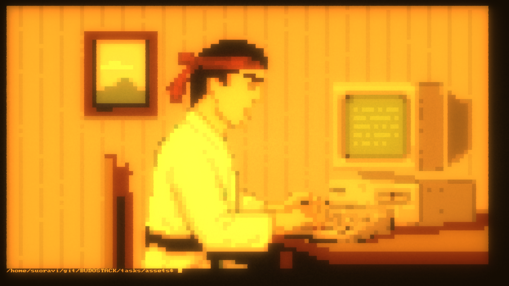

# BUDOSTACK - The Martial Art of Software
**Creator:** Ville Suoranta 
**Email:** ville.m.suoranta(at)gmail.com 
**Status:** Early Access (in development)

→ Check out website from [HERE](https://sensei-zenabi.github.io/suoranta/index.html)

## Description:
A lightweight operating "layer" built atop POSIX-compliant Linux, 
specifically designed for those who value the elegant simplicity 
and clarity found in operating systems of the 1980s. Optimized for 
maximum focus and efficiency on basic primitives of computing, 
such as file manipulation, text editing, command-line interactions, 
and efficient resource management.

Screenshots from BUDOSTACK built-in retro terminal emulator (apps/terminal).

|  |  |  |  |
|:---------------------------:|:---------------------------:|:---------------------------:|:---------------------------:|

## How to Install and Run?
1. Checkout the repo.
2. Install dependencies for your environment:
   * Debian/Ubuntu: run `./setup_debian.sh`
   * Termux: run `./setup_termux.sh`
3. Run `./start.sh`.
4. Then type `help`.

### Build targets
* `make all` auto-detects the environment. In Termux it builds the Termux profile; otherwise it builds the Debian profile.
* `make debian` builds BUDOSTACK for Debian/Ubuntu and includes `apps/terminal` when SDL2 and OpenGL development files are available.
* `make termux` builds BUDOSTACK for Termux and intentionally excludes `apps/terminal`.
* You can force auto-build behavior with `make BUDOSTACK_PLATFORM=debian all` or `make BUDOSTACK_PLATFORM=termux all`.

### Running outside the built-in terminal
* On Debian/Ubuntu, `./start.sh` launches BUDOSTACK inside the retro-styled `apps/terminal` emulator with the CRT shader stack enabled by default when that binary is available.
* On Termux, `apps/terminal` is not built, so `./start.sh` falls back to running `./budostack` in the current terminal.
* If you prefer to stay in your own GUI terminal emulator, you can run `./budostack` directly. The shell detects VTE/Konsole-style terminals and skips the resize escape sequence that used to displace the cursor, so the prompt and block cursor stay aligned.

### apps/terminal runtime controls
`apps/terminal` also supports runtime CLI frame pacing controls:
* `--fps <hz>` controls display rendering pace (default `60`, `0` disables pacing).
* `--shader-fps <hz>` controls shader animation pace (default `60`, `0` disables shader timing).

Examples:
* `./apps/terminal --fps 120`
* `./apps/terminal --fps 0`
* `./apps/terminal -s ./shaders/noise.glsl --shader-fps 30`

Values are validated in the range `0..1000`.

## Licence:
BUDOSTACK is distributed under GPL-2.0 license, which is a is a free 
copyleft license, that allows you to:
- Run the software for any purpose
- Study and modify the source code
- Redistribute copies, both original and modified, provided you will 
distribute them under the same GPL-2.0 terms and include the source 
code.

**Note!** Files shared under folders:
- ./fonts/
- ./shaders/
- ./sounds/

Are not distributed using the GLP-2.0 license. Instead, these folders 
contain their own LICENSE.txt files indicating their licensing conditions.

