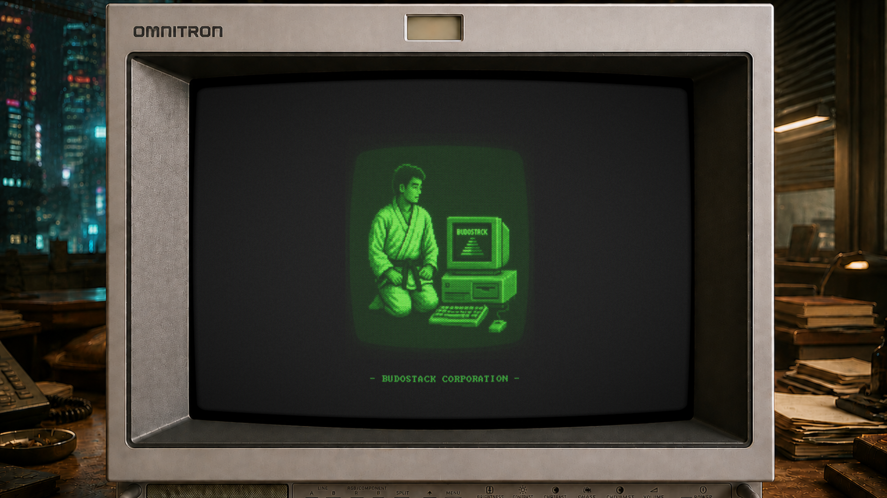
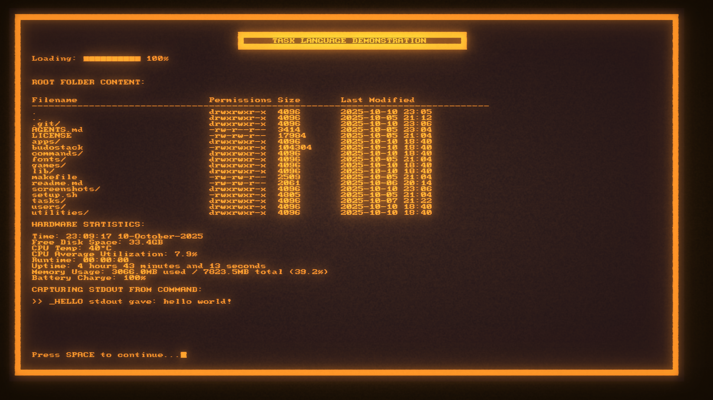
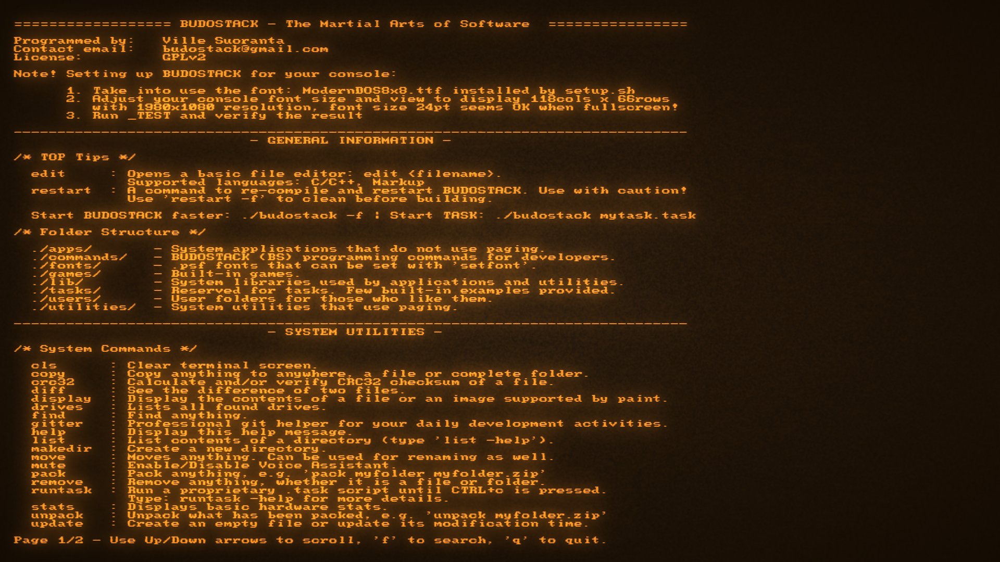
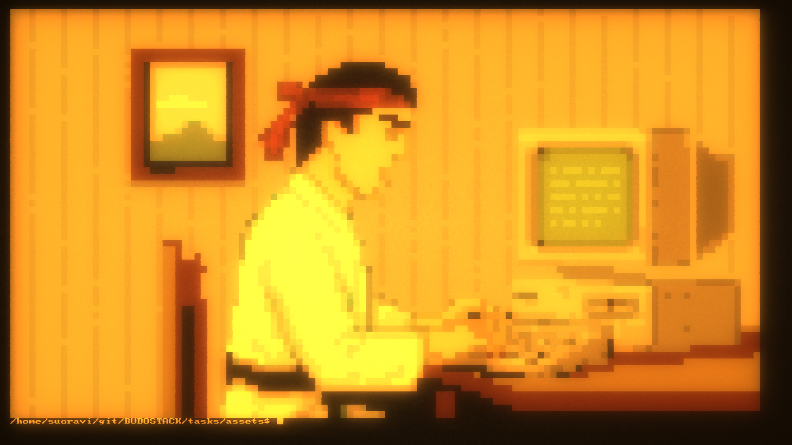

# BUDOSTACK - The Martial Art of Software
**Creator:** Ville Suoranta 
**Email:** ville.m.suoranta(at)gmail.com 
**Status:** Early Access (in development)

→ Check out website from [HERE](https://sensei-zenabi.github.io/suoranta/index.html)

## Description:
A lightweight operating "layer" built atop POSIX-compliant Linux, 
specifically designed for those who value the elegant simplicity 
and clarity found in operating systems of the 1980s. Optimized for 
maximum focus and efficiency on basic primitives of computing, 
such as file manipulation, text editing, command-line interactions, 
and efficient resource management.

The terminal defaults to HIGH (640x480, 80x60 cells with the 8x8 font).
LOW uses 320x240 (40x30 cells). `_TERM_RESOLUTION HIGH` and
`_TERM_RESOLUTION LOW` select these modes; custom pixel dimensions remain
supported. Applications use the active terminal size. Games scale and center
their boards. Native graphical applications in `budo/` retain their own
320x240 or 640x480 mode.

Screenshots from BUDOSTACK built-in retro terminal emulator (apps/terminal).

|  |  |  |  |
|:---------------------------:|:---------------------------:|:---------------------------:|:---------------------------:|

## How to Install and Run?
1. Checkout the repo.
2. Install dependencies for your environment:
   * Debian/Ubuntu: run `./setup_debian.sh`
   * Termux: run `./setup_termux.sh`
3. Run `./start.sh`.
4. Then type `help`.

This is all you need to install and run BUDOSTACK in your linux PC.

## Details
### Build targets
* `make all` auto-detects the environment. In Termux it builds the Termux profile; otherwise it builds the Debian profile.
* `make debian` builds BUDOSTACK for Debian/Ubuntu and includes `apps/terminal` when SDL2 and OpenGL development files are available.
* `make termux` builds BUDOSTACK for Termux and intentionally excludes `apps/terminal`.
* You can force auto-build behavior with `make BUDOSTACK_PLATFORM=debian all` or `make BUDOSTACK_PLATFORM=termux all`.

### Running outside the built-in terminal
* On Debian/Ubuntu, `./start.sh` launches BUDOSTACK inside the retro-styled `apps/terminal` emulator with the CRT shader stack enabled by default when that binary is available.
* On Termux, `apps/terminal` is not built, so `./start.sh` falls back to running `./budostack` in the current terminal.
* If you prefer to stay in your own GUI terminal emulator, you can run `./budostack` directly. The shell detects VTE/Konsole-style terminals and skips the resize escape sequence that used to displace the cursor, so the prompt and block cursor stay aligned.

### apps/terminal runtime controls
`apps/terminal` also supports runtime CLI frame pacing controls:
* `--fps <hz>` controls display rendering pace (default `60`, `0` disables pacing).
* `--shader-fps <hz>` controls shader animation pace (default `60`, `0` disables shader timing).

Examples:
* `./apps/terminal --fps 120`
* `./apps/terminal --fps 0`
* `./apps/terminal -s ./shaders/noise.glsl --shader-fps 30`

Values are validated in the range `0..1000`.

## Licence:
BUDOSTACK is distributed under GPL-2.0 license, which is a is a free 
copyleft license, that allows you to:
- Run the software for any purpose
- Study and modify the source code
- Redistribute copies, both original and modified, provided you will 
distribute them under the same GPL-2.0 terms and include the source 
code.

**Note!** Files shared under folders:
- ./fonts/
- ./shaders/
- ./sounds/

Are not distributed using the GPL-2.0 license. Instead, these folders 
contain their own LICENSE.txt files indicating their licensing conditions.

### Terminal and overlay sizing

`TERMINAL_WIDTH`, `TERMINAL_HEIGHT`, `TERMINAL_OFFSET_X`, and
`TERMINAL_OFFSET_Y` in `config.ini` configure terminal content through
`_TERM_SIZE` and `_TERM_OFFSET`. Width/height are percentages (0–100),
while offsets are signed percentages (−100–100). Decimals are allowed.
Positive X moves right; positive Y moves down from the centered position.
A zero dimension uses the full layout on that axis.

`_TERM_LAYOUT_ASPECT=5:4` defines the terminal reference layout while the
overlay is enabled: scale uniformly to screen height and center it.
Narrower displays crop at screen edges without changing scale. Terminal sizes and offsets use this layout's
width and height. Set `screen` for independent screen-relative percentages.
For example, `TERMINAL_WIDTH=80` and `TERMINAL_HEIGHT=75` use 80% of the
reference layout width and 75% of its height. Resolution changes retain
terminal proportions, including graphics apps and mouse mapping.
When the overlay is disabled, autoexec uses `_TERM_SIZE 0 0` and
`_TERM_OFFSET 0 0` for the full screen.

`_TERM_OVERLAY_ZOOM <percent>` scales the overlay image uniformly around
screen center, preserving the native image aspect independently of the
terminal layout. 100 matches screen height; 80 uses 80% of screen height;
120 enlarges it to 120%. Screen edges crop the image as needed.
Range: 1–1000, decimals allowed.
`_TERM_OVERLAY_OFFSET <x_percent> <y_percent>` shifts the image using
percentages of screen height on BOTH axes. Positive X moves right and
positive Y moves down. Range: −100–100.
These commands affect only the overlay image; use terminal settings to
align content with its opening.

Overlay boot settings are `_TERM_OVERLAY_ZOOM`, `_TERM_OVERLAY_OFFSET_X`,
and `_TERM_OVERLAY_OFFSET_Y`. The bundled zoom is 125. Image geometry is
recalculated from current screen height on each redraw and retained while
disabled.

Custom configs using the previous terminal keys must rename `OVERLAY_WIDTH`,
`OVERLAY_HEIGHT`, `OVERLAY_OFFSET_X`, and `OVERLAY_OFFSET_Y` to their
`TERMINAL_` equivalents. Keep the `_TERM_OVERLAY_*` image settings unchanged.

Terminal layout scaling always uses screen height. Configurations calibrated
with the former width-fitting behavior on a narrower display can preserve
their fit by multiplying terminal width, height, and both offsets by
`screen_aspect / _TERM_LAYOUT_ASPECT`. For 5:4 with a 4:3 layout, this is
0.9375. The bundled settings include this conversion.
