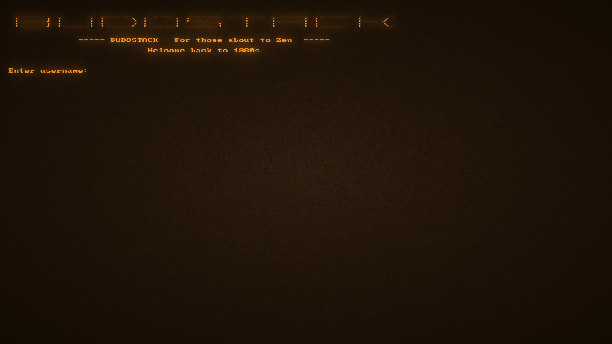

# BUDOSTACK - The Martial Art of Software
**Creator:** Ville Suoranta 
**Email:** ville.m.suoranta(at)gmail.com 
**Status:** Early Access (in development)

→ Check out website from [HERE](https://sensei-zenabi.github.io/suoranta/index.html)

## Description:
A lightweight operating "layer" built atop POSIX-compliant Linux, 
specifically designed for those who value the elegant simplicity 
and clarity found in operating systems of the 1980s. Optimized for 
maximum focus and efficiency on basic primitives of computing, 
such as file manipulation, text editing, command-line interactions, 
and efficient resource management.

Screenshots from BUDOSTACK built-in retro terminal emulator (apps/terminal).

|  |  |  |  |
|:---------------------------:|:---------------------------:|:---------------------------:|:---------------------------:|

## Folder Structure
* `./apps/`        - System applications that do not use paging.
* `./budo/`        - Libraries that provide MS-DOS-like access to apps/terminal graphics,
  sound, and input for BUDOSTACK C application developers.
* `./commands/`    - Stand-alone TASK scripting commands.
* `./documents/`   - Documents provided by BUDOSTACK.
* `./fonts/`       - System fonts.
* `./games/`       - Games (users can develop more with C with the help of `./budo/` libs).
* `./lib/`         - System libraries used by all applications and utilities.
* `./screenshots/` - Contains the advertisement screenshots.
* `./shaders/`     - Shaders used by apps/terminal.
* `./sounds/`      - System sounds.
* `./tasks/`       - TASK scripts. Examples provided.
* `./users/`       - User folders for those who like them.
* `./utilities/`   - System utilities that can use paging (except ones listed in `nopaging.ini`).

## How to Install and Run?
1. Checkout the repo
2. Run ./setup.sh 
3. Run ./start.sh
4. Then type "help"

### Running outside the built-in terminal
* `./start.sh` still launches BUDOSTACK inside the retro-styled `apps/terminal` emulator with the CRT shader stack enabled by default.
* If you prefer to stay in your own GUI terminal emulator, you can run `./budostack` directly. The shell detects VTE/Konsole-style terminals and skips the resize escape sequence that used to displace the cursor, so the prompt and block cursor stay aligned.

## Licence:
BUDOSTACK is distributed under GPL-2.0 license, which is a is a free 
copyleft license, that allows you to:
- Run the software for any purpose
- Study and modify the source code
- Redistribute copies, both original and modified, provided you will 
distribute them under the same GPL-2.0 terms and include the source 
code.

**Note!** Files shared under folders:
- ./fonts/
- ./shaders/
- ./sounds/

Are not distributed using the GLP-2.0 license. Instead, these folders 
contain their own LICENSE.txt files indicating their licensing conditions.
