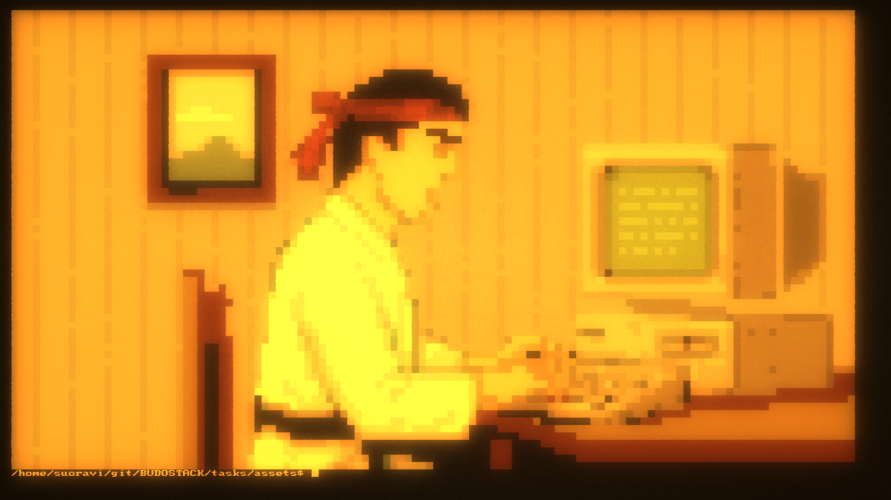

# BUDOSTACK - The Martial Art of Software
**Programmed by:** Ville Suoranta 
**Status:** Early Access (in development)

→ Check out website from [HERE](https://sensei-zenabi.github.io/suoranta/index.html)

### Licence:
BUDOSTACK is distributed under GPL-2.0 license, which is a is a free 
copyleft license, that allows you to:
- Run the software for any purpose
- Study and modify the source code
- Redistribute copies, both original and modified, provided you will 
distribute them under the same GPL-2.0 terms and include the source 
code.

## Description:
A lightweight operating "layer" built atop POSIX-compliant Linux, 
specifically designed for those who value the elegant simplicity 
and clarity found in operating systems of the 1980s. Optimized for 
maximum focus and efficiency on basic primitives of computing, 
such as file manipulation, text editing, command-line interactions, 
and efficient resource management.

Screenshots from BUDOSTACK built-in retro terminal emulator (apps/terminal).

|  |  |  |  |
|:---------------------------:|:---------------------------:|:---------------------------:|:---------------------------:|

## How to Install and Run?
1. Checkout the repo
2. Run the ./setup.sh shell script
3. Type "./start.sh"
4. Then type "help"

